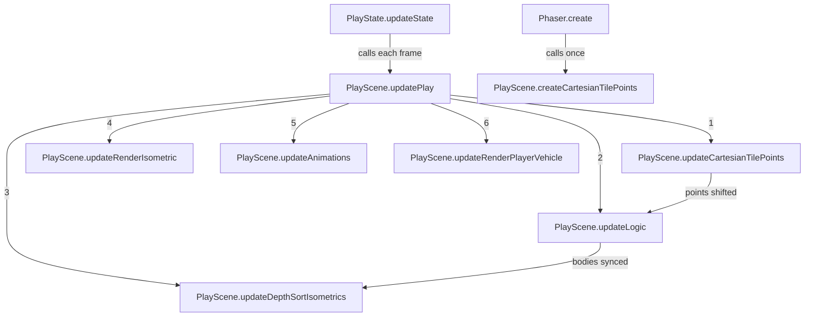
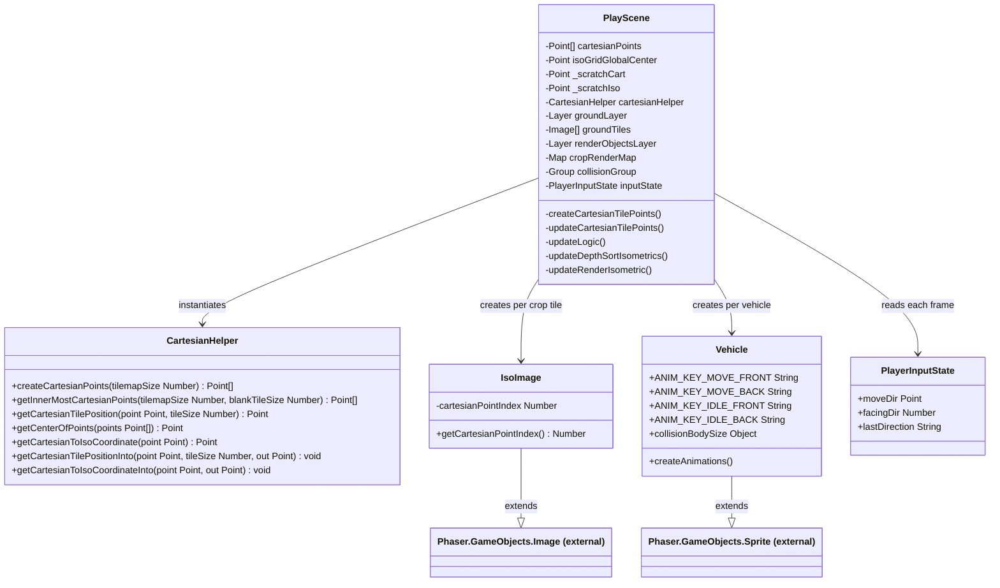

# Isometric Rendering and Logic

## Coordinate Systems

The game uses two coordinate spaces that are converted back and forth each frame.

**Cartesian space** is the logical grid. Each tile lives at an integer `(x, y)` index. To get its pixel position within that space, the index is multiplied by `TILE_SIZE = 64`. So tile `(3, 2)` → pixel `(192, 128)` in Cartesian space.

**Isometric (screen) space** is what the player sees. The projection formula maps Cartesian pixels to screen pixels using a standard 2:1 dimetric projection:

```
isoX = (cartX - cartY) / 2
isoY = (cartX + cartY) / 4
```

The divisors come from the tile art dimensions: `TILE_SIZE = 64`, `ISO_TILE_HEIGHT = 32`. Dividing by 2 compresses the horizontal axis; dividing by 4 gives the 2:1 slope.

Example — tile `(3, 2)`:
| Step | x | y |
|---|---|---|
| Grid index | 3 | 2 |
| × TILE_SIZE (64) | 192 | 128 |
| Iso projection | 32 | 80 |
| + isoGridGlobalCenter | screen x | screen y |

All projected positions are then offset by `isoGridGlobalCenter`, computed once in `createMembers()` to center the grid on the 800×600 canvas:

```ts
this.isoGridGlobalCenter = new Point(
    this.cameras.main.width * 0.5,
    this.cameras.main.height * 0.5 - this.isoGridHeight * 0.5
);
```

---

## Dual-Representation Pattern

Every interactive object (crops, player) exists as **two separate instances** that are linked by a shared `cartesianIndex`.

```
cartesianPoints[i]  ──────────────────────────────────────────────
                                                                  │
        ┌─────────────────────────────────┐                       │
        │  Logic object                   │  (Arcade.Image)       │
        │  · lives in Cartesian px space  │◄──────────────────────┘
        │  · drives physics / collision   │  body.x = cartX
        │  · alpha = 0 (invisible)        │  body.y = cartY
        │  · data('cartesianIndex') = i   │
        └─────────────────────────────────┘
                        │ overlap detected
                        ▼
        ┌─────────────────────────────────┐
        │  Render object                  │  (IsoImage / Vehicle)
        │  · lives in ISO screen space    │
        │  · no physics body              │  x = isoGridGlobalCenter.x + isoX
        │  · getCartesianPointIndex() = i │  y = isoGridGlobalCenter.y + isoY
        └─────────────────────────────────┘
```

When a collision is detected, `onPlayerCollision` reads `cartesianIndex` from the logic object and uses it to look up the matching render object in O(1) via `cropRenderMap`:

```ts
const index = object.data.get('cartesianIndex');
const renderObject = this.cropRenderMap.get(index);
if (renderObject) {
    this.cropRenderMap.delete(index);
    renderObject.destroy();
}
```

`cropRenderMap` is a `Map<number, IsoImage>` populated during `createObjectTiles()` alongside the `renderObjectsLayer`. Deleting the entry before `destroy()` keeps the map free of stale references as crops are harvested. Both the logic object and render object are destroyed independently.

---

## Render Layers and Depth Sorting

Two `Phaser.GameObjects.Layer` instances control draw order:

| Layer | Contents | Notes |
|---|---|---|
| `groundLayer` | Static ground tiles | Never depth-sorted; always behind everything |
| `renderObjectsLayer` | Crops + vehicles | Y-sorted each frame when moving |

Depth sorting is done by Y position — objects lower on screen (higher Y) appear in front of objects higher on screen, which is the visual rule for isometric scenes. The sort is skipped when the grid is stationary to avoid the cost:

```ts
private updateDepthSortIsometrics() {
    if (this.inputState.moveDir.x === 0 && this.inputState.moveDir.y === 0) return;
    this.renderObjectsLayer.sort('y', (a, b) => a.y < b.y ? -1 : a.y > b.y ? 1 : 0);
}
```

The player vehicle is part of `renderObjectsLayer` and participates in this sort. It is identified by `isoImage.name === 'player'` in `updateRenderIsometric()` — that check skips updating its position (the vehicle stays fixed on screen while the grid scrolls around it).

---

## Infinite Scroll

The grid creates the illusion of movement by shifting `cartesianPoints` each frame and wrapping out-of-bounds values back to the opposite edge. The player's logic object and render vehicle stay fixed at the center of the screen.

**moveDir is inverted from intuition.** When the player presses right, `moveDir.x = -1`. The grid scrolls left (negative), making it look like the vehicle is driving right. The same inversion applies on the Y axis.

Each frame in `updateCartesianTilePoints()`, every point is shifted:

```ts
point.x += moveDir.x * MOVE_SPEED;   // e.g. -0.2 when pressing right
point.y += moveDir.y * MOVE_SPEED;
```

When a point goes out of the `[0, TILEMAP_SIZE]` range it wraps to the opposite side, keeping the grid seamlessly infinite.

After the points are updated, `updateLogic()` syncs each physics body's position to match its (now shifted) Cartesian point — so collisions follow the scrolling grid:

```ts
this.cartesianHelper.getCartesianTilePositionInto(
    this.cartesianPoints[object.data.get('cartesianIndex')],
    this.TILE_SIZE,
    this._scratchCart
);
body.x = this._scratchCart.x;
body.y = this._scratchCart.y;
```

`_scratchCart` and `_scratchIso` are pre-allocated `Point` instances reused each frame to avoid creating ~300k garbage-collected objects per second.

---

## Flowchart of Function Calls



---

## Class Diagram


## Considerations / Improvements
What's done well:
- The dual-representation pattern cleanly sidesteps the hardest problem with isometric physics — logic stays in flat Cartesian space where Arcade physics works      
  naturally, rendering is a pure projection step
- The scratch-point optimization (_scratchCart/_scratchIso) shows real performance awareness — avoiding 300k allocations/sec in a GC'd language matters
- The infinite scroll is elegant: shift points, wrap at boundaries, done — no tile pool, no respawning logic
- The skip-when-stationary guard on depth sort is a smart cheap win

Things that have tradeoffs:
- updateRenderIsometric() and updateLogic() both iterate all ~1,681 points every frame unconditionally. For tiles scrolled off-screen this is wasted work, though at
  this scale it's unlikely to be the bottleneck.
- The depth sort runs on renderObjectsLayer which includes all crops + vehicles — that's potentially O(n log n) on 1,600 objects every frame while moving. In        
  practice Phaser's sort is fast enough, but it's something to watch if you add more objects.
