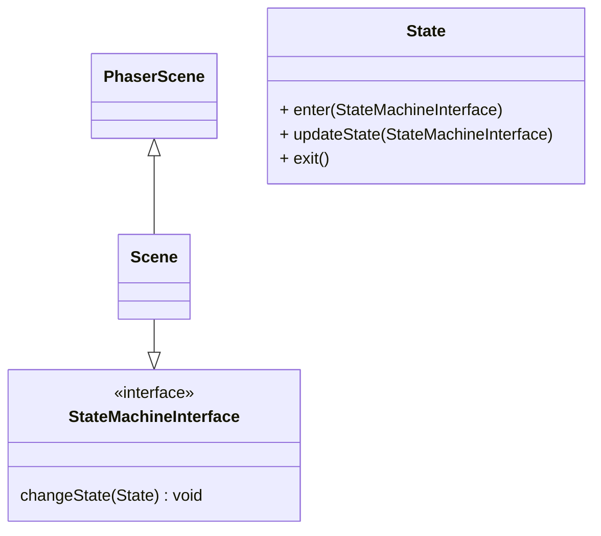

# State Machine
This document explains the state-machine concept applied inside the game.
Scenes that want to implement different states to manage its logic implement the StateMachineInterface



The Scene implementing the interface then manages internal states. This allows to separate complex game logic into states and update them respectively.

Example:
```
    changeState(newState: State): void {
        if (this.currentGameState) {
            this.currentGameState.exit();
        }

        this.currentGameState = newState;

        if (this.currentGameState) {
            this.currentGameState.enter(this);
        }
    }
```


