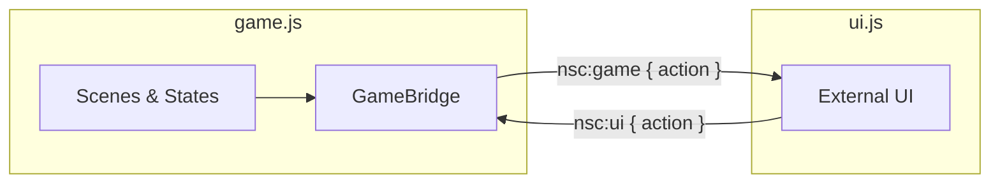

# HTML User Interface

The game UI lives outside the Phaser canvas as plain HTML/CSS. The game bundle and the UI are completely separate — they share no code and no imports. They communicate through browser-native `CustomEvent`s on `window`.

---

## Communication principle

Two event names, one per direction. Every event carries a `detail.action` string.



The UI registers one listener and switches on `action`. New game events never require new listener registrations — just a new case in the switch.

```js
window.addEventListener('nsc:game', (e) => {
  switch (e.detail.action) { ... }
});

window.dispatchEvent(new CustomEvent('nsc:ui', {
  detail: { action: '...' }
}));
```

Internally, scenes and states emit on a `Phaser.Events.EventEmitter` singleton (`EventBus`). The `GameBridge` translates between that internal bus and the window events — it is the only place that knows both sides.
